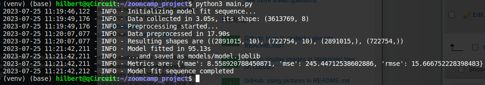

# zoomcamp_project

The [dataset](https://www.kaggle.com/datasets/mczielinski/bitcoin-historical-data) is located at Kaggle. It includes one-minute interval of Bitcoin price. The columns show the real change in price of Bitcoin indicating the Open, High, Low, Close price of Bitcoin on particular minutes. The dataset can be downloaded via [kaggle API](https://www.kaggle.com/docs/api):

```
!kaggle datasets download -d mczielinski/bitcoin-historical-data
```

**Description:** 

Bitcoin, the pioneering cryptocurrency, has gained significant popularity and attention in recent years. Its decentralized nature, limited supply, and potential for high returns have made it a preferred investment option for individuals and institutions. As a result, predicting the price of Bitcoin has become increasingly important for various stakeholders, including investors, traders, financial institutions, and policymakers.

<details>
    <summary>Click for more description</summary>

Predicting Bitcoin prices has significant implications for various stakeholders, including investors, traders, risk managers, financial planners, and policymakers. Accurate price forecasts empower individuals and institutions to make informed investment decisions, manage risks effectively, develop trading strategies, optimize asset allocations, and assess the impact of cryptocurrencies on the broader economy. By leveraging advanced analytical techniques, predictive models can enhance market efficiency, increase profitability, and contribute to the overall understanding of the cryptocurrency market dynamics.

The dataset contains base data on the trading volume and types of a price within a period: Open, Close, Max, Min. The prediction focuses on the *Close* price, i.e. the final price at a period end.
</details>

**Set up environment**

The environment includes all the required packages installed via [requirements.txt](requirements.txt) file.

**Baseline Run**

Baseline model set, run and located here: *[baseline.ipynb](baseline.ipynb)*.

**Logging**

To keep logs the built-in logger with the data logged in *[logs.log](logs.log)*



a


<details>
    <summary> Example of the output: </summary>

    
</details>