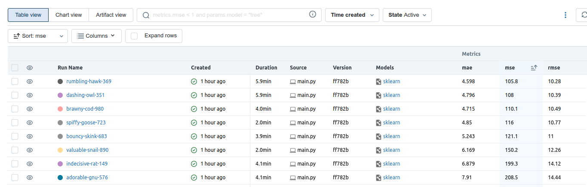
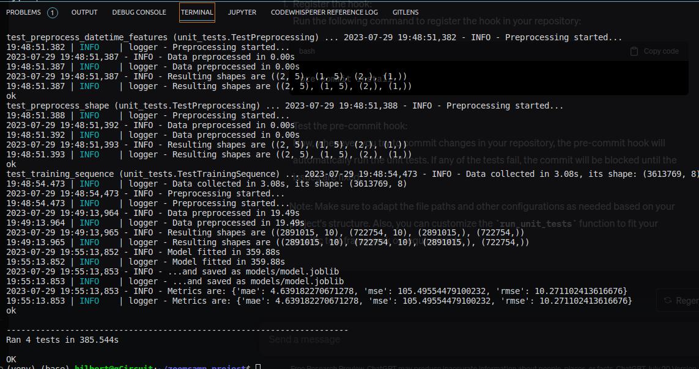

# zoomcamp_project

The [dataset](https://www.kaggle.com/datasets/mczielinski/bitcoin-historical-data) is located at Kaggle. It includes one-minute interval of Bitcoin price. The columns show the real change in price of Bitcoin indicating the Open, High, Low, Close price of Bitcoin on particular minutes. The dataset can be downloaded via [kaggle API](https://www.kaggle.com/docs/api):

```
!kaggle datasets download -d mczielinski/bitcoin-historical-data
```

**Description:**

Bitcoin, the pioneering cryptocurrency, has gained significant popularity and attention in recent years. Its decentralized nature, limited supply, and potential for high returns have made it a preferred investment option for individuals and institutions. As a result, predicting the price of Bitcoin has become increasingly important for various stakeholders, including investors, traders, financial institutions, and policymakers.

<details>
    <summary>Click for more description</summary>

Predicting Bitcoin prices has significant implications for various stakeholders, including investors, traders, risk managers, financial planners, and policymakers. Accurate price forecasts empower individuals and institutions to make informed investment decisions, manage risks effectively, develop trading strategies, optimize asset allocations, and assess the impact of cryptocurrencies on the broader economy. By leveraging advanced analytical techniques, predictive models can enhance market efficiency, increase profitability, and contribute to the overall understanding of the cryptocurrency market dynamics.

The dataset contains base data on the trading volume and types of a price within a period: Open, Close, Max, Min. The prediction focuses on the *Close* price, i.e. the final price at a period end.
</details>

**Set up environment**

The environment includes all the required packages installed via [requirements.txt](requirements.txt) file.

**Baseline Run**

Baseline model set, run and located here: *[baseline.ipynb](baseline.ipynb)*.

**Logging**

To keep logs the built-in logger with the data logged in *[logs.log](logs.log)*


**Experiment Tracking""

Experiment tracking is perfromed by mlflow. The result of hyperparameters tuning is the logged metrics and models for each combination of the model's params:



To execute the tracking you should perform the following sequence:

```
1. activate prefect server: prefect server start
2. run the main.py (within you can select either the optimization or single fit mode): python3 main.py
3. activate user interface: mlflow ui --backend-store-uri sqlite:///mlruns.db
```

**Orchestration**

The project management processes are controlled and tracked via *prefect*:


The prefect task of data retrival is set for 3 times of retry with 2 seconds delay:

```
@task(retries=3, retry_delay_seconds=2)
def get_data(file_path):
    ...

```

In the best case the model is updated permanently from an online datasource. The scheduler is set during the deployment. Additionaly the fit model is supported by built-in prefect logger:

```
@task(log_prints=True)
def fit_model(xtr, xts, ytr, yts):
    ...

 ```

Project infastructure is deployed with prefect to the git repo and scheduled via:
```
prefect project init
prefect deploy train_model.py:train_sequence -n bitcoin_price_prediction -p bitcoin_price_prediction
```

**Dockerize**
Prediction module also deployed separately within app [web-service](web-service). It can be run either using flask or gunicorn. Alternatively, since it is dockerized:

```
docker run -it --rm -p 9696:9696 bitcoin_price_prediction
```

the app can be brought up via docker as a prediction service.

**Monitoring**

Monitoring is performed with the means of evidently (see [baseline](baseline.ipynb))

**Unit Tests**
Unit and integrity tests are located in module: [unit_tests.py](unit_tests.py) and can be called via selecting MODE=3 in the (main.py)[main.py] file. All the mentioned tests are passed:



**Pre-commit hook**
The configuration of the hooks is set in [.pre-commit-config.yaml](.pre-commit-config.yaml) file.
